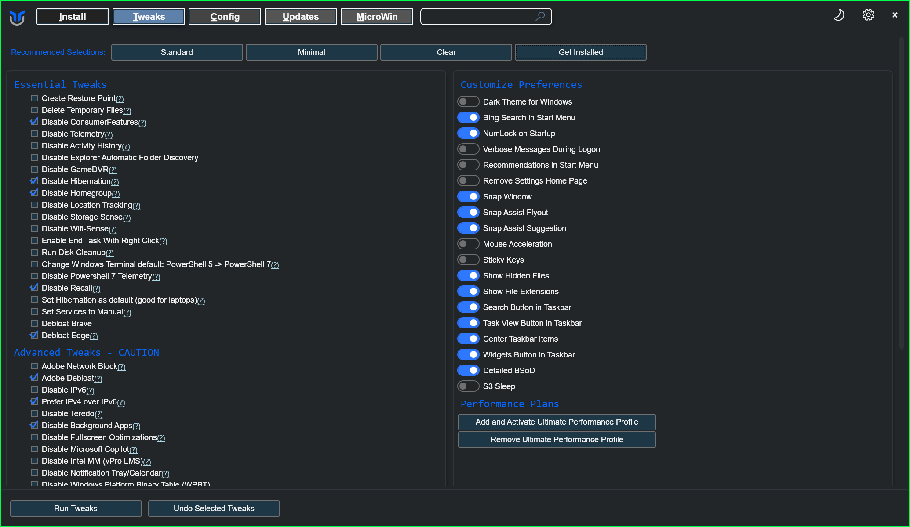

# <a name="top"></a><h1 align="center">✨My Windows 11 Customization Journey &<br> User Guide / Future Reference✨</h1>

<p align="center">
Welcome! This project documents how I customized my Windows 11 installation, starting from a default setup to its current state.<br>
The intention is for this to serve as a reference for myself and a user guide for others.
</p>
<br>
<p align="center">
Feel free to support my strugglin ass and get my 2 year old daughter a snack here:&nbsp;&nbsp;&nbsp;&nbsp;&nbsp;
</p><br>
<p align="center">
  <a href="https://coff.ee/dotdotswagt" target="_blank" rel="noopener noreferrer">
    
  </a>
</p><br>

<div align="center">

   &nbsp;
   &nbsp;
   &nbsp;
  
  [](https://git.io/typing-svg)
  </div>


<p align="center">
🧹 Let's start by creating a MicroWin (Debloated Windows ISO) using the beloved <a href="https://github.com/ChrisTitusTech/winutil" target="_blank" rel="noopener noreferrer"><strong>Chris Titus Windows Utility</strong></a>.<br>
I created this script which ensures Winget is installed before running. 🧹
</p>

<p align="center">
  <a href="https://github.com/Cinabutts/MyWin11/releases/download/Release_v1.0.0/WinGet-ChrisTitus-Setup.ps1" download>
    📥 Download WinGet-ChrisTitus-Setup.ps1
  </a>
</p>
<p align="center">
  
</p>

<div align="center">
<details>
  <summary>Details: </summary>

```powershell
Write-Host "===============================================================" -ForegroundColor Cyan
Write-Host "===  Automated WinGet/ChrisTitus Setup & Tweak Script       ===" -ForegroundColor Cyan
Write-Host "===============================================================" -ForegroundColor Cyan
Write-Host "--> Checking for Winget installation..." -ForegroundColor Yellow
if (Get-Command winget -ErrorAction SilentlyContinue) {
    Write-Host "SUCCESS: Winget is already installed." -ForegroundColor Green
} else {
    Write-Host "INFO: Winget not found. Starting installation process..." -ForegroundColor Yellow
    try {
        Write-Host "--> Downloading the latest Winget installer..." -ForegroundColor Yellow
        $wingetInstallerPath = Join-Path -Path $env:TEMP -ChildPath "winget.msixbundle"
        Invoke-WebRequest -Uri "https://github.com/microsoft/winget-cli/releases/latest/download/Microsoft.DesktopAppInstaller_8wekyb3d8bbwe.msixbundle" -OutFile $wingetInstallerPath -ErrorAction Stop

        Write-Host "--> Installing Winget..." -ForegroundColor Yellow
        Add-AppxPackage -Path $wingetInstallerPath -ErrorAction Stop
        
        Write-Host "SUCCESS: Winget has been installed." -ForegroundColor Green
    } catch {
        Write-Error "FATAL: Winget installation failed. Aborting script."
        return
    }
}
Write-Host "`n--> Verifying Winget is ready..." -ForegroundColor Yellow
winget --version
Write-Host "`n"
Write-Host "Press ANY KEY to continue and launch the Chris Titus utility..." -ForegroundColor Magenta
$Host.UI.RawUI.ReadKey("NoEcho,IncludeKeyDown") | Out-Null
Write-Host "`n--> Launching the Chris Titus utility..." -ForegroundColor Cyan
irm "https://christitus.com/win" | iex
Write-Host "`nScript finished." -ForegroundColor Green
```

<p align="center">
🧹 Here you can remove all the bloatware and turn off all the telemetry etc, Here's my config. 🧹
</p>

<p align="center">

</p>

<p align="center">
If you are starting fresh click "MicroWin" and follow the instructions there. Use a pre-existing ISO, or create a new one with the latest Windows 11 ISO.
</p>

<p align="center">
━━━━━━━━━━━━━━━━━━━━━━━━━━━━━━━━━━━━━━━━━━━━
</p></details></div><br>

---

## <h1 align="center">🧩 Tweak / Customization Mods 🧩</h1>

---

<br><br>
<div align="center">

### &nbsp;&nbsp;&nbsp;&nbsp; ** Ultimate Windows Tweaker (UWT)**

<em>Description:</em> WAY too many tweaks to list here.  
<em>Download Link:</em> <a href="https://www.thewindowsclub.com/ultimate-windows-tweaker-5-for-windows-11">Ultimate Windows Tweaker</a>

<details>
  <summary>Click to expand screenshots</summary>
  <br>
  <details>
    <summary><strong>   Customization</strong></summary>
    <p align="center">
      
      
      
      
    </p>
    <p align="right"><a href="#-tweak--customization-mods-">Back to Section Top 🔝</a></p>
  </details>
  <details>
    <summary><strong>   Performance</strong></summary>
    <p align="center">
      
    </p>
    <p align="right"><a href="#-tweak--customization-mods-">Back to Section Top 🔝</a></p>
  </details>
  <details>
    <summary><strong>   Security & Privacy</strong></summary>
    <p align="center">
      
      
    </p>
    <p align="right"><a href="#-tweak--customization-mods-">Back to Section Top 🔝</a></p>
  </details>
  <details>
    <summary><strong>   Context Menu</strong></summary>
    <p align="center">
      
    </p>
    <p align="right"><a href="#-tweak--customization-mods-">Back to Section Top 🔝</a></p>
  </details>
  <details>
    <summary><strong>   Additional</strong></summary>
    <p align="center">
      
    </p>
    <p align="right"><a href="#-tweak--customization-mods-">Back to Section Top 🔝</a></p>
  </details>
</details></div><br>

---

<br>

<div align="center">

### &nbsp;&nbsp;&nbsp;&nbsp; ** Winaero Tweaker**
  
_Description:_ WAY too many tweaks to list here.  
_Download Link:_ [Winaero Tweaker](https://winaero.com/winaero-tweaker/)

<details>
<summary>Config</summary>
<p align="center">
  <a href="https://github.com/Cinabutts/MyWin11/releases/download/Release_v1.0.0/WinaeroTweaker-Config_07_27_25.ini" download>
    <strong>My Configuration .ini</strong>
  </a><br>
  <em>Once Winaero Tweaker is installed, import this config under <code>File → Import/Export Tweaks</code></em>
</p>
<p align="center">
  <a href="https://github.com/Cinabutts/MyWin11/releases/download/Release_v1.0.0/WinaeroTweaker-Config_07_27_25.ini">
    
  </a>
</p>
</details>
</div><br>

---

<div align="left"><sup>✨</sup><strong>Custom Scripts inside</strong><sup>✨</sup></div>

<div align="center">

### &nbsp;&nbsp;&nbsp;&nbsp; ** AutoHotKey**

_Description:_ Allows for automating tasks and remapping keys.  
_Download Link:_ [AutoHotKey](https://www.autohotkey.com/) &nbsp;&nbsp;&nbsp;&nbsp;&nbsp;&nbsp;&nbsp;&nbsp;[GitHub Repo](https://github.com/AutoHotkey/AutoHotkey)
  <p align="center">
    <a href="https://www.autohotkey.com/download/ahk-install.exe">
      
    </a>
    <a href="https://www.autohotkey.com/download/ahk-v2.exe">
      
    </a>
  </p>

<details>
  <summary>Scripts: </summary><br>
  <div align="center">
    <strong>Better_Win-Tab.ahk</strong>
    <p align="center">
      <a href="https://github.com/Cinabutts/MyWin11/releases/download/Release_v1.0.0/Better_Win-Tab.ahk">
        
      </a>
    </p>
    <p><em>Description:</em> Allows you to use the mouse wheel to<br>scroll between tabs. <i>(Space to select)</i></p>
  </div>
  <div align="center">
    <details>
      <summary>Script 1:</summary>
      <div align="left">
      <!-- markdownlint-disable -->

```ahk <!----------------------------------------------------------AHK-Script1 -->
; Better Win-Tab by Cinabutts    (https://github.com/Cinabutts)
#Requires AutoHotkey v2.0
#SingleInstance Force
#WinActivateForce

; 24H2 requires explicit process priority
ProcessSetPriority "High"

; Target updated window classes
#HotIf WinActive("ahk_class XamlExplorerHostIslandWindow")
WheelUp::Send "{Left}"
WheelDown::Send "{Right}"
#HotIf
```

</div></details></div>
      <!-- markdownlint-enable -->
<br>

---

<div align="center">
  <strong>Better_Alt-Tab.ahk</strong>
  <p align="center">
    <a href="https://github.com/Cinabutts/MyWin11/releases/download/Release_v1.0.0/Better_Alt-Tab.ahk">
        
      </a>
    </p>
    <p><em>Description:</em>
      Replaces the default alt tab with a more<br>customizable list of windows.
    </p>
</div>

<div align="center">
  <details>
    <summary>Script 2:</summary>
    <div align="left">
<!-- markdownlint-disable -->

```ahk <!----------------------------------------------------------AHK-Script2 -->
;Alt-Tab Replacement by jeeswg    (https://github.com/jeeswg)

#SingleInstance force
ListLines, Off
#KeyHistory 0
Menu, Tray, Click, 1
#NoEnv
AutoTrim, Off
#UseHook
;#NoTrayIcon

SplitPath, A_ScriptName,,,, vScriptNameNoExt
Menu, Tray, Tip, % vScriptNameNoExt

;==================================================

;options:
;the order in which items will appear
;specify zero to exclude an item
vListVisibleWindows := 1
vListIntExpTabs := 2
vListDesktop := 3
vListNewIntExp := 0

;==================================================

vListCount := 4
;hIcon := DllCall("user32\LoadIcon", Ptr,0, Ptr,32512, Ptr) ;IDI_APPLICATION := 32512
;get Desktop icon (tested on Windows 7)
hIconDT := LoadPicture("shell32.dll", "w16 h16 icon35", vType)
hIconDTBig := LoadPicture("shell32.dll", "w32 h32 icon35", vType)
;get Internet Explorer icon
hIconIE := LoadPicture("C:\Program Files\Internet Explorer\iexplore.exe", "w16 h16", vType)
hIconIEBig := LoadPicture("C:\Program Files\Internet Explorer\iexplore.exe", "w32 h32", vType)

Gui, New, +HwndhGui -Caption +E0x80 Border, Alt-Tab Replacement
Gui, Font, s16
Gui, Color, ABCDEF
Gui, Add, Picture, +HwndhStcImg x4 y4 w32 h32 +0x3 ;SS_ICON := 0x3
;Gui, Add, Picture, +HwndhStcImg x10 y10 w16 h16 +0x3 ;SS_ICON := 0x3
Gui, Add, Text, +HwndhStc x40 y6 w500
Gui, Add, ListView, -Hdr x-2 y40 w530 h280, Window Title
return

;==================================================

GuiClose:
ExitApp
return

;==================================================

!Tab::
+!Tab::
vIndex += InStr(A_ThisHotkey, "+")?-1:1
Gui, % hGui ":Default"

if !DllCall("user32\IsWindowVisible", "Ptr",hGui)
{
	;==============================
	Hotkey, IfWinActive, % "ahk_id " hGui
	Hotkey, *Esc, DoCancel, On
	LV_Delete(), IL_Destroy(hIL)
	hIL := IL_Create(30) ;small icons
	;hIL := IL_Create(30, 30, 1) ;large icons
	LV_SetImageList(hIL)
	vCount := 0, vPrompt := "", oHWnd := {}, oTitle := {}, oHIcon := {}, oHIconBig := {}
	Loop % vListCount
	{
		if (A_Index = vListVisibleWindows)
		{
			DetectHiddenWindows, Off
			WinGet, vWinList, List
			Loop % vWinList
			{
				hWnd := vWinList%A_Index%
				if !JEE_WinHasAltTabIcon(hWnd)
					continue
				WinGetTitle, vWinTitle, % "ahk_id " hWnd
				vCount += 1
				oHWnd.Push(hWnd)
				oTitle.Push(vWinTitle)
				oHIcon.Push(JEE_WinGetIcon(hWnd))
				oHIconBig.Push(JEE_WinGetIcon(hWnd, 1))
				IL_Add(hIL, "HICON:" oHIcon[vCount])
				LV_Add("Icon" vCount, vWinTitle)
			}
			DetectHiddenWindows, On
		}
		if (A_Index = vListDesktop)
		{
			vCount += 1
			oHWnd.Push("Desktop")
			oTitle.Push("Desktop")
			oHIcon.Push(hIconDT)
			oHIconBig.Push(hIconDTBig)
			IL_Add(hIL, "HICON:*" oHIcon[vCount])
			LV_Add("Icon" vCount, oTitle[vCount])
		}
		if (A_Index = vListIntExpTabs)
		{
			WinGet, vWinList, List, ahk_class TabThumbnailWindow
			Loop % vWinList
			{
				hWnd := vWinList%A_Index%
				WinGetTitle, vWinTitle, % "ahk_id " hWnd
				if (vWinTitle = "Blank Page - Internet Explorer")
				|| !(vWinTitle ~= " - Internet Explorer$")
					continue
				vCount += 1
				oHWnd.Push(hWnd)
				oTitle.Push(vWinTitle)
				oHIcon.Push(JEE_WinGetIcon(hWnd))
				;oHIconBig.Push(JEE_WinGetIcon(hWnd, 1))
				;the icons retrieved are small, therefore enlarge them:
				hIcon := JEE_WinGetIcon(hWnd, 1)
				hIcon := LoadPicture("HICON:" hIcon, "w32 h32", vType)
				oHIconBig.Push(hIcon)
				IL_Add(hIL, "HICON:" oHIcon[vCount])
				LV_Add("Icon" vCount, vWinTitle)
			}
		}
		if (A_Index = vListNewIntExp)
		{
			vCount += 1
			oHWnd.Push("NewIntExp")
			oTitle.Push("New Internet Explorer Window")
			oHIcon.Push(hIconIE)
			oHIconBig.Push(hIconIEBig)
			IL_Add(hIL, "HICON:*" oHIcon[vCount])
			LV_Add("Icon" vCount, oTitle[vCount])
		}
	}
	;Loop 2
	;	LV_Add("Icon0", "")
	;==============================
	vIndex := 2
	Gui, Show, y250 w500 h300
	SetTimer, CheckAlt, 30
}
if (vIndex < 1)
	vIndex := vCount
if (vIndex > vCount)
	vIndex := 1
ControlSetText,, % oTitle[vIndex], % "ahk_id " hStc
SendMessage, 0x170, % oHIconBig[vIndex], 0,, % "ahk_id " hStcImg ;STM_SETICON := 0x170
;SendMessage, 0x170, % oHIcon[vIndex], 0,, % "ahk_id " hStcImg ;STM_SETICON := 0x170

;LV_Modify(vIndex, "Focus")
LV_Modify(0, "-Select")
LV_Modify(vIndex, "Select")
LV_Modify(vIndex, "Vis")
return

;==================================================

CheckAlt:
if !GetKeyState("Alt", "P")
{
	SetTimer, CheckAlt, Off
	WinHide, % "ahk_id " hGui
	DetectHiddenWindows, On
	if (oHWnd[vIndex] = "Desktop")
		WinMinimizeAll
	else if (oHWnd[vIndex] = "NewIntExp")
		Run, iexplore.exe
	else
		WinActivate, % "ahk_id " oHWnd[vIndex]
}
return

;==================================================

DoCancel:
SetTimer, CheckAlt, Off
Hotkey, IfWinActive, % "ahk_id " hGui
Hotkey, *Esc, DoCancel, Off
WinHide, % "ahk_id " hGui
return

;==================================================

;JEE_WinGetHIcon
JEE_WinGetIcon(hWnd, vDoGetBig:=0)
{
	static vSfx := (A_PtrSize=8) ? "Ptr" : ""
	if !hWnd || !WinExist("ahk_id " hWnd)
		return 0
	if vDoGetBig
	{
		if (hIcon := DllCall("user32\SendMessage", "Ptr",hWnd, "UInt",0x7F, "UPtr",1, "Ptr",0, "Ptr")) ;WM_GETICON := 0x7F ;ICON_BIG := 1
		|| (hIcon := DllCall("user32\SendMessage", "Ptr",hWnd, "UInt",0x7F, "UPtr",0, "Ptr",0, "Ptr")) ;WM_GETICON := 0x7F ;ICON_SMALL := 0
		|| (hIcon := DllCall("user32\SendMessage", "Ptr",hWnd, "UInt",0x7F, "UPtr",2, "Ptr",0, "Ptr")) ;WM_GETICON := 0x7F ;ICON_SMALL2 := 2
		|| (hIcon := DllCall("user32\GetClassLong" vSfx, "Ptr",hWnd, "Int",-14, "UPtr")) ;GCL_HICON := -14 ;(big icon)
		|| (hIcon := DllCall("user32\GetClassLong" vSfx, "Ptr",hWnd, "Int",-34, "UPtr")) ;GCL_HICONSM := -34 ;(small icon)
		|| (hIcon := DllCall("user32\LoadIcon", "Ptr",0, "Ptr",32512, "Ptr")) ;IDI_APPLICATION := 32512 ;(standard exe icon)
			return hIcon
	}
	else
	{
		if (hIcon := DllCall("user32\SendMessage", "Ptr",hWnd, "UInt",0x7F, "UPtr",0, "Ptr",0, "Ptr")) ;WM_GETICON := 0x7F ;ICON_SMALL := 0
		|| (hIcon := DllCall("user32\SendMessage", "Ptr",hWnd, "UInt",0x7F, "UPtr",2, "Ptr",0, "Ptr")) ;WM_GETICON := 0x7F ;ICON_SMALL2 := 2
		|| (hIcon := DllCall("user32\SendMessage", "Ptr",hWnd, "UInt",0x7F, "UPtr",1, "Ptr",0, "Ptr")) ;WM_GETICON := 0x7F ;ICON_BIG := 1
		|| (hIcon := DllCall("user32\GetClassLong" vSfx, "Ptr",hWnd, "Int",-34, "UPtr")) ;GCL_HICONSM := -34 ;(small icon)
		|| (hIcon := DllCall("user32\GetClassLong" vSfx, "Ptr",hWnd, "Int",-14, "UPtr")) ;GCL_HICON := -14 ;(big icon)
		|| (hIcon := DllCall("user32\LoadIcon", "Ptr",0, "Ptr",32512, "Ptr")) ;IDI_APPLICATION := 32512 ;(standard exe icon)
			return hIcon
	}
	return 0
}

;==================================================

;info for: JEE_WinHasTaskbarButton/JEE_WinHasAltTabIcon

;will it appear on the alt-tab dialog/taskbar:
;WS_CHILD := 0x40000000 ;A maybe, T maybe (appears to make no difference re. presence on list, but does affect the alt-tab icon's appearance)
;WS_VISIBLE := 0x10000000 ;(if off:) A no, T no
;WS_DISABLED := 0x8000000 ;A no, T maybe
;WS_EX_NOACTIVATE := 0x8000000 ;A no, T maybe
;WS_EX_APPWINDOW := 0x40000 ;A yes, T yes
;WS_EX_TOOLWINDOW := 0x80 ;A no, T no (T: under some conditions it seems you can have WS_EX_TOOLWINDOW and a taskbar button)
;has owner ;A maybe, T no
;has parent ;A no, T no
;note: WS_EX_APPWINDOW takes priority over WS_EX_TOOLWINDOW

;Window Styles | Microsoft Docs
;https://docs.microsoft.com/en-us/windows/desktop/winmsg/window-styles
;Extended Window Styles | Microsoft Docs
;https://docs.microsoft.com/en-us/windows/desktop/winmsg/extended-window-styles
;WS_EX_APPWINDOW:
;Forces a top-level window onto the taskbar when the window is visible.
;WS_EX_NOACTIVATE:
;The window does not appear on the taskbar by default. To force the window to appear on the taskbar, use the WS_EX_APPWINDOW style.
;WS_EX_TOOLWINDOW:
;A tool window does not appear in the taskbar or in the dialog that appears when the user presses ALT+TAB.

;from the AHK documentation:
;An owned window has no taskbar button by default, and when visible it is always on top of its owner.

;script for testing:
;DetectHiddenWindows, On
;Gui, New, +HwndhGui -0xFFFFFFFF -E0xFFFFFFFF
;Gui, Show, W300 H300

;hWndParent := DllCall("user32\GetAncestor", Ptr,hWnd, UInt,1, Ptr) ;GA_PARENT := 1
;hWndOwner := DllCall("user32\GetWindow", Ptr,hWnd, UInt,4, Ptr) ;GW_OWNER := 4

;example: WS_EX_TOOLWINDOW on and has no taskbar button
;DetectHiddenWindows, On
;Gui, New, +HwndhGui -0xFFFFFFFF -E0xFFFFFFFF +E0x80 ;WS_EX_TOOLWINDOW := 0x80
;Gui, Show, W300 H300

;example: WS_EX_TOOLWINDOW on but has a taskbar button
;DetectHiddenWindows, On
;Gui, New, +HwndhGui -0xFFFFFFFF -E0xFFFFFFFF
;Gui, Show, W300 H300
;WinSet, ExStyle, +0x80, % "ahk_id " hGui ;WS_EX_TOOLWINDOW := 0x80

;==================================================

;gives you roughly the correct results (tested on Windows 7)
;JEE_WinIsTaskbar
JEE_WinHasTaskbarButton(hWnd)
{
	local
	if !(DllCall("user32\GetDesktopWindow", "Ptr") = DllCall("user32\GetAncestor", "Ptr",hWnd, "UInt",1, "Ptr")) ;GA_PARENT := 1
	|| DllCall("user32\GetWindow", "Ptr",hWnd, "UInt",4, "Ptr") ;GW_OWNER := 4 ;affects taskbar but not alt-tab
		return 0
	if DllCall("user32\GetWindow", "Ptr",hWnd, "UInt",4, "Ptr") ;GW_OWNER := 4 ;affects taskbar but not alt-tab
		return 0
	WinGet, vWinStyle, Style, % "ahk_id " hWnd
	if !vWinStyle
	|| !(vWinStyle & 0x10000000) ;WS_VISIBLE := 0x10000000
	;|| (vWinStyle & 0x8000000) ;WS_DISABLED := 0x8000000 ;affects alt-tab but not taskbar
		return 0
	WinGet, vWinExStyle, ExStyle, % "ahk_id " hWnd
	if (vWinExStyle & 0x40000) ;WS_EX_APPWINDOW := 0x40000
		return 1
	;under some conditions it seems you can have WS_EX_TOOLWINDOW and a taskbar button
	if (vWinExStyle & 0x80) ;WS_EX_TOOLWINDOW := 0x80
	;|| (vWinExStyle & 0x8000000) ;WS_EX_NOACTIVATE := 0x8000000 ;affects alt-tab but not taskbar
		return 0
	return 1
}

;==================================================

;gives you roughly the correct results (tested on Windows 7)
;JEE_WinIsAltTab
JEE_WinHasAltTabIcon(hWnd)
{
	local
	if !(DllCall("user32\GetDesktopWindow", "Ptr") = DllCall("user32\GetAncestor", "Ptr",hWnd, "UInt",1, "Ptr")) ;GA_PARENT := 1
	;|| DllCall("user32\GetWindow", "Ptr",hWnd, "UInt",4, "Ptr") ;GW_OWNER := 4 ;affects taskbar but not alt-tab
		return 0
	WinGet, vWinStyle, Style, % "ahk_id " hWnd
	if !vWinStyle
	|| !(vWinStyle & 0x10000000) ;WS_VISIBLE := 0x10000000
	|| (vWinStyle & 0x8000000) ;WS_DISABLED := 0x8000000 ;affects alt-tab but not taskbar
		return 0
	WinGet, vWinExStyle, ExStyle, % "ahk_id " hWnd
	if (vWinExStyle & 0x40000) ;WS_EX_APPWINDOW := 0x40000
		return 1
	if (vWinExStyle & 0x80) ;WS_EX_TOOLWINDOW := 0x80
	|| (vWinExStyle & 0x8000000) ;WS_EX_NOACTIVATE := 0x8000000 ;affects alt-tab but not taskbar
		return 0
	return 1
}
```

</div></details></div>
</details>

<br>

<!-- markdownlint-enable -->

---

<div align="right"><sup>✨</sup><strong>Custom Scripts inside</strong><sup>✨</sup></div>

<div align="center">

<!-- markdownlint-disable-next-line MD013 -->
###  **Context Menu Tuner**

_Description:_
  Allows custom Context Menu items (files/folders/shell locations).<br>
  _Download Link:_ [Context Menu Tuner (by Winaero)](https://winaero.com/download-context-menu-tuner/)

<em>📌 **Note**: It does not allow for removal of any context menu items unfortunately.</em>
</div>

<details>
  <summary>Details: </summary>
<table align="center">
  <tr>
    <td>
      
    </td>
    <td style="vertical-align: top; padding-top: 20px;">
      <strong>Legend:</strong><br>
      🔵 = 📜 Custom made scripts<br>
      🟢 = 🛠️ Winaero Tweaker
    </td>
  </tr>
</table>

<p align="center"><strong>Save under <code>C:/Scripts</code></strong> for easy accessibility</p><br>

📜 [**Re-Sort:**](https://github.com/Cinabutts/MyWin11/releases/download/Release_v1.0.0/Re-Sort.ahk)<br>
<em>
  Runs a custom script to resort the desktop icons,
  assumes the default state is Date Modified.
</em>

<p align="center">
  <a href="https://github.com/Cinabutts/MyWin11/releases/download/Release_v1.0.0/Re-Sort.ahk">
    
  </a>
</p>

<details>
  <summary>Setup Re-Sort context button</summary>
    <p align="center"><em>Install <a href="#--autohotkey">AutoHotKey</a>,
    both are necessary. This specific script relies on v1 though.</em></p>
  <p align="center"><em>"Executable File Path"</em></p>

  ```text
  C:\Program Files\AutoHotkey\v1.1.37.02\AutoHotkeyU64.exe
  ```

  <p align="center"><em>"Command Line Arguments"</em></p>

  ```text
  "C:\Scripts\Re-Sort.ahk"
  ```

</details><br>

📜 [**Create Restore Point:**](https://github.com/Cinabutts/MyWin11/releases/download/Release_v1.0.0/CreateRestorePoint.ps1)<br>
<em>
Self explanatory.
</em>

<p align="center">
  <a href="https://github.com/Cinabutts/MyWin11/releases/download/Release_v1.0.0/CreateRestorePoint.ps1">
    
  </a>
</p>

<details>
  <summary>Setup CreateRestorePoint context button</summary>
  <p align="center"><em>Install PowerShell v7 via the Chris Titus script above ^</em></p>

  

  <p align="center"><em>"Executable File Path"</em></p>

  ```text
  C:\Program Files\PowerShell\7\pwsh.exe
  ```

  <p align="center"><em>"Command Line Arguments"</em></p>

  ```text
  "C:\Scripts\CreateRestorePoint.ps1"
  ```
  
</details>

<br>

<!-- markdownlint-disable-next-line MD013 -->
🛠️ **Kill not responding tasks:** Self explanatory.  

<!-- markdownlint-disable-next-line MD013 -->
🛠️ **Layout:** Shows a submenu to toggle menu bar Detail/Preview/Navigation panes etc.  

<!-- markdownlint-disable-next-line MD013 -->
🛠️ **Restart Explorer:** Shows a submenu to restart Explorer or stop Explorer and start upon key press.
<br>

📜 [**Create Registry Backup:**](https://github.com/Cinabutts/MyWin11/releases/download/Release_v1.0.0/Create-RegBackup.bat)<br>
Self explanatory. <em><small>Set to be only visible with Shift + right-click on desktop.</small></em>

<p align="center">
  <a href="https://github.com/Cinabutts/MyWin11/releases/download/Release_v1.0.0/Create-RegBackup.bat">
    
  </a>
</p>

<details>
  <summary>Setup Create-RegBackup context button</summary>

  <p align="center"><em>"Executable File Path"</em></p>

  ```text
  C:\WINDOWS\system32\conhost.exe
  ```

  <p align="center"><em>"Command Line Arguments"</em></p>

  ```text
  "C:\Scripts\Create-RegBackup.bat"
  ```

</details>

📜 [**Create System Links:**](https://github.com/Cinabutts/MyWin11/releases/download/Release_v1.0.0/Create-Syslink.ps1)<br>
<em>
This script is very useful for the <code>C:/Scripts</code> folder,
it can create a system link<br> from wherever you click to any folder.<br>
<small>Set to be only visible with Shift + right-click on Folders.</small>
</em>

<p align="center">
  <a href="https://github.com/Cinabutts/MyWin11/releases/download/Release_v1.0.0/Create-Syslinks.ps1">
    
  </a>
</p>

<details>
  <summary>Setup Create-RegBackup context button</summary>

  <p align="center"><em>"Executable File Path"</em></p>

  ```text
  C:\Program Files\PowerShell\7\pwsh.exe
  ```

  <p align="center"><em>"Command Line Arguments"</em></p>

  ```text
  "C:\Scripts\Create-Symlinks.ps1" "%1"
  ```

</details>

<p align="center"><br>
━━━━━━━━━━━━━━━━━━━━━━━━━━━━━━━━━━━━━━━━━━━━
</p>
</details>

&nbsp;

<br><br>

---

<h1 align="center">🎨 Appearance Mods 🎨</h1>

---

<div style="display: flex; align-items: center;">
  
  <div>
      ⚠️<strong>Note:</strong>
      <sub>
        If you are having HDR issues in things like
        your Screensaver or VSCode, you might want to try out Wallpaper Engine.
      </sub>
    <div align="center">
      <sup>The <strong>$5</strong> is worth it.
      Then you'll just have to drag/drop the mp4 files into the Wallpaper Editor.
      </sup>
    </div>
    <sub>Also in my opinion Lively seems to be dead in comparison.</sub><br>
    <sup>And this has more if not the same amount of features.</sup>

<a href="https://store.steampowered.com/app/431960/Wallpaper_Engine/">
  Wallpaper Engine</a>
  <sub>&nbsp;&nbsp;&nbsp;&nbsp;&nbsp;(Steam)</sub><br>
<a href="https://www.wallpaperengine.io/en">
  Wallpaper Engine</a>
  <sub>&nbsp;&nbsp;&nbsp;&nbsp;&nbsp;(Website)</sub>
  </div>
</div><br>

======================================
<!-- markdownlint-disable-next-line MD013 -->
###  <strong>Lively Wallpaper</strong>  

_Description:_ Set animated desktop wallpapers and screensavers.  
_Download Link:_ [Lively Wallpaper](https://www.rocksdanister.com/lively/)
&nbsp;&nbsp;&nbsp;&nbsp;&nbsp;&nbsp;&nbsp;
[GitHub Repo](https://github.com/rocksdanister/lively)

<details><!-- -----------------------------------LIVELY WALLPAPERS/SCREENSAVERS -->
  <summary>My Lively Wallpapers / Screensavers</summary>
  <br>
  <p align="center">
    <a href="https://moewalls.com/abstract/abstract-organic-lines-live-wallpaper/">
      <strong>abstract organic lines</strong>
    </a>
  </p>

  <p align="center">
    <a href="https://www.desktophut.com/meteor-over-clouds-9009">
      <strong>meteor over clouds</strong>
    </a>
  </p>

  <p align="center">
    <a href="https://www.desktophut.com/tropical-green-leaves-6917">
      <strong>tropical green leaves</strong>
    </a>
  </p>

  <p align="center">
    <a href="https://moewalls.com/landscape/green-home-live-wallpaper/">
      <strong>green home</strong>
    </a>
  </p>

  <p align="center">
    <a href="https://moewalls.com/lifestyle/peaceful-ruins-live-wallpaper/">
      <strong>peaceful ruins</strong>
    </a>
  </p>

  <p align="center">
    <a href="https://moewalls.com/landscape/poppy-hill-our-life-beginnings-and-always-live-wallpaper/">
      <strong>poppy hill</strong>
    </a>
  </p>

  <p align="center">
    <a href="https://moewalls.com/abstract/windows-10-colorful-live-wallpaper/">
      <strong>windows 10 colorful</strong>
    </a>
  </p>
  
  <p align="center">
  ━━━━━━━━━━━━━━━━━━━━━━━━━━━━━━━━━━━━━━━━━━━━
  </p>
</details>

---

&nbsp;&nbsp;&nbsp;&nbsp;
<!-- markdownlint-disable-next-line MD013 -->
###  **DWMGlass**  

_Description:_
  Add custom effect to global system title bar, supports Windows 10 and 11.  
_Download Link:_
[GitHub Repo](https://github.com/Maplespe/DWMBlurGlass)

&nbsp;

---

&nbsp;&nbsp;&nbsp;&nbsp;
<!-- markdownlint-disable-next-line MD013 -->
###  **Windhawk**  

_Description:_
  The customization marketplace for Windows and programs.  
_Download Link:_ [Windhawk](https://windhawk.net/)
&nbsp;&nbsp;&nbsp;&nbsp;&nbsp;&nbsp;&nbsp;&nbsp;
[GitHub Repo](https://github.com/ramensoftware/windhawk)

&nbsp;

&nbsp;

---

<!-- markdownlint-disable-next-line MD013 -->
<h2 align="center" style="display: flex; justify-content: center; align-items: center; gap: 10px; font-weight: 900;">
  
  Windhawk Mods &amp; Code Snippets
  
</h2>

<p align="center">
  Here you'll find all my Windhawk Advanced Mod Settings,
  Inclusion lists Exclusion lists and side notes.
</p>

---

<p align="center">
  The <strong>✅INCLUSION/❌EXCLUSION</strong> Lists should be under:
  <code>Settings - Advanced Settings</code>
</p><br><br>

<p align="center">
  &nbsp;&nbsp;&nbsp;&nbsp;&nbsp;&nbsp;&nbsp;&nbsp;
  After installing a mod <strong>paste</strong> the code into the corresponding mods:
  <code>Advanced - Mod Settings</code>.<br><br>
  &nbsp;&nbsp;&nbsp;&nbsp;&nbsp;&nbsp;&nbsp;&nbsp;
  <strong>Default</strong> = no changes were made to the mod's settings.
</p>

---

<p align="right">
<strong>❌EXCLUSION</strong> List:
</p>

<p align="right">
ControllerCompanion.exe
</p>

---

<p align="left">
<strong>✅INCLUSION</strong> List:
</p>

<p align="left">
winlogon.exe<br>
logonui.exe<br>
TextInputHost.exe<br>
explorer.exe<br>
</p>

---

<br>

<!-- markdownlint-disable-next-line MD013 -->
<h3 align="center" style="display: flex; justify-content: center; align-items: center; gap: 10px; font-weight: 900;">
  
  Windhawk Advanced Mod Settings
</h3>

<br>

---

<div align="center">
  <details>
    <summary>💡 Click to Expand</summary>

<br>

<div align="left">

- **Mod Identifier:**&nbsp;&nbsp;&nbsp;&nbsp;taskbar-empty-space-clicks  
<!-- markdownlint-disable -->

```json
{
  "doubleClickAction": "ACTION_COMBINE_TASKBAR_BUTTONS",
  "middleClickAction": "ACTION_WIN_TAB",
  "oldTaskbarOnWin11": 0,
  "CombineTaskbarButtons.State1": "COMBINE_ALWAYS",
  "CombineTaskbarButtons.State2": "COMBINE_NEVER",
  "CombineTaskbarButtons.StateSecondary1": "COMBINE_ALWAYS",
  "CombineTaskbarButtons.StateSecondary2": "COMBINE_NEVER",
  "VirtualKeyPress[0]": "0x5B",
  "VirtualKeyPress[1]": "0x45",
  "StartProcess": "C:\\Windows\\System32\\notepad.exe"
}
```

---
  
- **Mod Identifier:**&nbsp;&nbsp;&nbsp;&nbsp;taskbar-wheel-cycle

```json
{
  "skipMinimizedWindows": 1,
  "wrapAround": 1,
  "reverseScrollingDirection": 0,
  "enableMouseWheelCycling": 1,
  "cycleLeftKeyboardShortcut": "Alt+VK_OEM_4",
  "cycleRightKeyboardShortcut": "Alt+VK_OEM_6",
  "oldTaskbarOnWin11": 0
}
```

---

- **Mod Identifier:**&nbsp;&nbsp;&nbsp;&nbsp;taskbar-left-click-cycle
  
- **Default**

---
  
- **Mod Identifier:**&nbsp;&nbsp;&nbsp;&nbsp;taskbar-button-click
  
- **Default**

---
  
- **Mod Identifier:**&nbsp;&nbsp;&nbsp;&nbsp;file-explorer-remove-suffixes
  
- **Default**

---
  
- **Mod Identifier:**&nbsp;&nbsp;&nbsp;&nbsp;slick-window-arrangement

```json
{
  "SnapWindowsWhenDragging": 1,
  "SnapWindowsDistance": 10,
  "KeysToDisableSnapping.Ctrl": 0,
  "KeysToDisableSnapping.Alt": 1,
  "KeysToDisableSnapping.Shift": 0,
  "SlidingAnimation": 0,
  "SnapWindowsWhenSliding": 1,
  "SlidingAnimationSlowdown": 15
}
```

---
  
- **Mod Identifier:**&nbsp;&nbsp;&nbsp;&nbsp;spoof-light-dark-theme
  
- **Default**

---
  
- **Mod Identifier:**&nbsp;&nbsp;&nbsp;&nbsp;taskbar-start-button-position

```json
{
  "startMenuOnTheLeft": 1,
  "startMenuWidth": 1210
}
```

---
  
- **Mod Identifier:**&nbsp;&nbsp;&nbsp;&nbsp;taskbar-auto-hide-speed

```json
{
  "showSpeedup": 250,
  "hideSpeedup": 250,
  "frameRate": 90,
  "oldTaskbarOnWin11": 0
}
```

---
  
- **Mod Identifier:**&nbsp;&nbsp;&nbsp;&nbsp;taskbar-icon-size

```json
{
  "TaskbarHeight": 42,
  "IconSize": 21,
  "TaskbarButtonWidth": 50,
  "IconSizeSmall": 16,
  "TaskbarButtonWidthSmall": 32
}
```

---
  
- **Mod Identifier:**&nbsp;&nbsp;&nbsp;&nbsp;taskbar-button-scroll

```json
{
  "scrollOverTaskbarButtons": 1,
  "scrollOverThumbnailPreviews": 1,
  "maximizeAndRestore": 0,
  "reverseScrollingDirection": 0,
  "oldTaskbarOnWin11": 0
}
```

---
  
- **Mod Identifier:**&nbsp;&nbsp;&nbsp;&nbsp;taskbar-thumbnail-reorder

- **Default**

---

- **Mod Identifier:**&nbsp;&nbsp;&nbsp;&nbsp;translucent-windows

- **Default**

```json
{
  "ThemeBackground": 0,
  "TextAlphaBlend": 0,
  "type": "mica_tabbed",
  "AccentBlurBehind": "00000000",
  "ImmersiveDarkTitle": 0,
  "ExtendFrame": 0,
  "CornerOption": "notrounded",
  "RainbowSpeed": 1,
  "TitlebarColor.ColorTitlebar": 0,
  "TitlebarColor.RainbowTitlebar": 0,
  "TitlebarColor.titlerbarstyles_active": "FF0000",
  "TitlebarColor.titlerbarstyles_inactive": "00FFFF",
  "TitlebarTextColor.ColorTitlebarText": 0,
  "TitlebarTextColor.RainbowTextColor": 0,
  "TitlebarTextColor.titlerbarcolorstyles_active": "FF0000",
  "TitlebarTextColor.titlerbarcolorstyles_inactive": "00FFFF",
  "BorderColor.ColorBorder": 1,
  "BorderColor.RainbowBorder": 1,
  "BorderColor.borderstyles_active": "FF0000",
  "BorderColor.borderstyles_inactive": "00FFFF",
  "BorderColor.MenuBorderColor": 0,
  "RuledPrograms[0].target": "",
  "RuledPrograms[0].ThemeBackground": 0,
  "RuledPrograms[0].TextAlphaBlend": 0,
  "RuledPrograms[0].type": "none",
  "RuledPrograms[0].AccentBlurBehind": "00000000",
  "RuledPrograms[0].ImmersiveDarkTitle": 0,
  "RuledPrograms[0].ExtendFrame": 0,
  "RuledPrograms[0].CornerOption": "default",
  "RuledPrograms[0].RainbowSpeed": 1,
  "RuledPrograms[0].TitlebarColor.ColorTitlebar": 1,
  "RuledPrograms[0].TitlebarColor.RainbowTitlebar": 1,
  "RuledPrograms[0].TitlebarColor.titlerbarstyles_active": "FF0000",
  "RuledPrograms[0].TitlebarColor.titlerbarstyles_inactive": "00FFFF",
  "RuledPrograms[0].TitlebarTextColor.ColorTitlebarText": 0,
  "RuledPrograms[0].TitlebarTextColor.RainbowTextColor": 0,
  "RuledPrograms[0].TitlebarTextColor.titlerbarcolorstyles_active": "FF0000",
  "RuledPrograms[0].TitlebarTextColor.titlerbarcolorstyles_inactive": "00FFFF",
  "RuledPrograms[0].BorderColor.ColorBorder": 0,
  "RuledPrograms[0].BorderColor.RainbowBorder": 0,
  "RuledPrograms[0].BorderColor.borderstyles_active": "FF0000",
  "RuledPrograms[0].BorderColor.borderstyles_inactive": "00FFFF"
}
```

---

- **Mod Identifier:**&nbsp;&nbsp;&nbsp;&nbsp;extension-change-no-warning

- **Default**

---

- **Mod Identifier:**&nbsp;&nbsp;&nbsp;&nbsp;windows-11-file-explorer-styler

```json
{
  "theme": "NoCommandBar",
  "controlStyles[0].target": "StackPanel#DetailsViewThumbnail > Grid[1]",
  "controlStyles[0].styles[0]": "Height=Auto",
  "styleConstants[0]": "",
  "resourceVariables[0].variableKey": "",
  "resourceVariables[0].value": "",
  "explorerFrameContainerHeight": 0
}
```

---

- **Mod Identifier:**&nbsp;&nbsp;&nbsp;&nbsp;windows-11-notification-center-styler

```json
{
  "theme": "Matter",
  "controlStyles": "[object Object],[object Object]",
  "styleConstants": "base = <AcrylicBrush TintColor=\"#FF00FF00\" TintOpacity=\"0.5\" TintLuminosityOpacity=\"0.3\" Opacity=\"0.7\" FallbackColor=\"#FF008000\" />,r1 = 18",
  "resourceVariables": "",
  "controlStyles[0].target": "Windows.UI.Xaml.Controls.Grid#RootGrid > Windows.UI.Xaml.Controls.ContentPresenter#ContentPresenter",
  "controlStyles[0].styles[0]": "<SolidColorBrush Color=\\\"#fffb00\\\" Opacity = \\\"0.5\\\" />",
  "resourceVariables[0].variableKey": "",
  "resourceVariables[0].value": ""
}
```

---

- **Mod Identifier:**&nbsp;&nbsp;&nbsp;&nbsp;windows-11-start-menu-styler


```json
{
  "controlStyles[0].target": "StartDocked.StartSizingFrame",
  "controlStyles[0].styles[0]": "MinWidth=1200",
  "controlStyles[0].styles[1]": "MaxWidth=1200",
  "controlStyles[0].styles[2]": "MaxHeight=1200",
  "controlStyles[1].target": "Windows.UI.Xaml.Controls.Grid#UndockedRoot",
  "controlStyles[1].styles[0]": "Width=900",
  "controlStyles[1].styles[1]": "Margin=305,-10,0,-60",
  "controlStyles[2].target": "Windows.UI.Xaml.Controls.Grid#AllAppsRoot",
  "controlStyles[2].styles[0]": "Visibility=Visible",
  "controlStyles[2].styles[1]": "Width=340",
  "controlStyles[2].styles[2]": "Margin=-1690,0,1690,-60",
  "controlStyles[3].target": "StartDocked.AllAppsGridListView#AppsList",
  "controlStyles[3].styles[0]": "Padding=90,13,6,16",
  "controlStyles[4].target": "StartMenu.PinnedList",
  "controlStyles[4].styles[0]": "Width=840",
  "controlStyles[4].styles[1]": "Height=600",
  "controlStyles[4].styles[2]": "Margin=-20,10,0,0",
  "controlStyles[5].target": "StartDocked.SearchBoxToggleButton",
  "controlStyles[5].styles[0]": "Visibility=Collapsed",
  "controlStyles[6].target": "StartDocked.LauncherFrame > Grid#RootGrid > Grid#RootContent > Grid#MainContent > Grid#InnerContent > Rectangle",
  "controlStyles[6].styles[0]": "Visibility=Collapsed",
  "controlStyles[7].target": "Windows.UI.Xaml.Controls.Grid#TopLevelSuggestionsContainer",
  "controlStyles[7].styles[0]": "Width=270",
  "controlStyles[7].styles[1]": "Margin=510,-670,0,0",
  "controlStyles[8].target": "Windows.UI.Xaml.Controls.GridView#RecommendedList > Windows.UI.Xaml.Controls.Border > Windows.UI.Xaml.Controls.ScrollViewer#ScrollViewer > Windows.UI.Xaml.Controls.Border#Root > Windows.UI.Xaml.Controls.Grid > Windows.UI.Xaml.Controls.ScrollContentPresenter#ScrollContentPresenter > Windows.UI.Xaml.Controls.ItemsPresenter > Windows.UI.Xaml.Controls.ItemsWrapGrid > Windows.UI.Xaml.Controls.GridViewItem",
  "controlStyles[8].styles[0]": "MaxWidth=250",
  "controlStyles[8].styles[1]": "MinWidth=250",
  "controlStyles[9].target": "Windows.UI.Xaml.Controls.GridView#RecommendedList",
  "controlStyles[9].styles[0]": "Visibility=Collapsed",
  "controlStyles[10].target": "Windows.UI.Xaml.Controls.Grid#TopLevelSuggestionsListHeader",
  "controlStyles[10].styles[0]": "Visibility=Collapsed",
  "controlStyles[11].target": "Windows.UI.Xaml.Controls.Grid#ShowMoreSuggestions",
  "controlStyles[11].styles[0]": "Visibility=Collapsed",
  "controlStyles[12].target": "Windows.UI.Xaml.Controls.Button#CloseAllAppsButton",
  "controlStyles[12].styles[0]": "Visibility=Collapsed",
  "controlStyles[13].target": "Windows.UI.Xaml.Controls.Button#ShowAllAppsButton",
  "controlStyles[13].styles[0]": "Visibility=Collapsed",
  "controlStyles[14].target": "Windows.UI.Xaml.Controls.Grid#AllAppsPaneHeader",
  "controlStyles[14].styles[0]": "Margin=97,-10,0,0",
  "controlStyles[15].target": "Windows.UI.Xaml.Controls.TextBlock#PinnedListHeaderText",
  "controlStyles[15].styles[0]": "Margin=-30,0,0,0",
  "controlStyles[16].target": "StartMenu.ExpandedFolderList",
  "controlStyles[16].styles[0]": "Margin=0,0,350,0",
  "controlStyles[17].target": "Windows.UI.Xaml.Controls.TextBlock#MoreSuggestionsListHeaderText",
  "controlStyles[17].styles[0]": "Margin=-30,0,0,0",
  "controlStyles[18].target": " Windows.UI.Xaml.Controls.Grid#MoreSuggestionsRoot ",
  "controlStyles[18].styles[0]": "Width=550",
  "controlStyles[18].styles[1]": "Margin=-360,0,0,0",
  "controlStyles[19].target": "StartDocked.NavigationPaneView#NavigationPane > Windows.UI.Xaml.Controls.Grid#RootPanel",
  "controlStyles[19].styles[0]": "Width=880",
  "controlStyles[19].styles[1]": "Margin=0,0,-290,0",
  "controlStyles[20].target": "StartDocked.AppListView#NavigationPanePlacesListView",
  "controlStyles[20].styles[0]": "Visibility=Visible",
  "controlStyles[21].target": "Border#AcrylicOverlay",
  "controlStyles[21].styles[0]": "Background:= <AcrylicBrush BackgroundSource=\"Backdrop\" TintColor=\"{ThemeResource SystemChromeAltHighColor}\" TintOpacity=\"1\" TintLuminosityOpacity=\".5\" />",
  "controlStyles[21].styles[1]": "Width=290",
  "controlStyles[21].styles[2]": "Margin=-905,0,0,-65",
  "controlStyles[21].styles[3]": "CornerRadius=5",
  "controlStyles[22].target": "Windows.UI.Xaml.Controls.SemanticZoom#ZoomControl",
  "controlStyles[22].styles[0]": "IsZoomOutButtonEnabled=false",
  "controlStyles[23].target": "Windows.UI.Xaml.Controls.Button#ZoomOutButton",
  "controlStyles[23].styles[0]": "Width=100",
  "controlStyles[23].styles[1]": "Height=25",
  "controlStyles[23].styles[2]": "CornerRadius=4",
  "controlStyles[23].styles[3]": "Margin=0,-35,0,0",
  "controlStyles[23].styles[4]": "VerticalAlignment=0",
  "controlStyles[24].target": "Windows.UI.Xaml.Controls.Button#ZoomOutButton > Windows.UI.Xaml.Controls.ContentPresenter#ContentPresenter > Windows.UI.Xaml.Controls.TextBlock",
  "controlStyles[24].styles[0]": "Text=\"...\"",
  "controlStyles[24].styles[1]": "FontSize=18",
  "controlStyles[25].target": "Windows.UI.Xaml.Controls.ContentPresenter#ZoomedOutPresenter",
  "controlStyles[25].styles[0]": "Margin=85,0,0,0",
  "controlStyles[26].target": "Border#AcrylicBorder",
  "controlStyles[26].styles[0]": "Background:=<AcrylicBrush TintColor=\"{ThemeResource SystemAccentColor}\" FallbackColor=\"{ThemeResource CardStrokeColorDefaultSolid}\" TintOpacity=\".85\" TintLuminosityOpacity=\"0.6\" Opacity=\"1\"/>",
  "controlStyles[27].target": "Windows.UI.Xaml.Controls.Border#ContentBorder@CommonStates > Windows.UI.Xaml.Controls.Grid#DroppedFlickerWorkaroundWrapper > Border#BackgroundBorder",
  "controlStyles[27].styles[0]": "Background@Normal:=<AcrylicBrush TintColor=\"{ThemeResource SystemAccentColor}\" FallbackColor=\"{ThemeResource CardStrokeColorDefaultSolid}\" TintOpacity=\"1\" TintLuminosityOpacity=\".45\" Opacity=\"25\"/>",
  "controlStyles[27].styles[1]": "Background@PointerOver:=<AcrylicBrush TintColor=\"{ThemeResource CardStrokeColorDefaultSolid}\" FallbackColor=\"{ThemeResource CardStrokeColorDefaultSolid}\" TintOpacity=\"1\" TintLuminosityOpacity=\".30\" Opacity=\"1\"/>",
  "controlStyles[28].target": "StartDocked.AppListView#NavigationPanePlacesListView > Windows.UI.Xaml.Controls.Border",
  "controlStyles[28].styles[0]": "Background:=<AcrylicBrush TintColor=\"{ThemeResource CardStrokeColorDefaultSolid}\" FallbackColor=\"{ThemeResource CardStrokeColorDefaultSolid}\" TintOpacity=\"1\" TintLuminosityOpacity=\"1\" Opacity=\"1\"/>",
  "controlStyles[28].styles[1]": "CornerRadius=18",
  "controlStyles[29].target": "Border#ContentBorder@CommonStates > Grid#DroppedFlickerWorkaroundWrapper > Border",
  "controlStyles[29].styles[0]": "FocusVisualPrimaryBrush:=<SolidColorBrush Color=\"#fe4eda\" Opacity=\"1\"/>",
  "controlStyles[29].styles[1]": "CornerRadius=50",
  "controlStyles[29].styles[2]": "Height=80",
  "controlStyles[29].styles[3]": "Width=92",
  "disableNewStartMenuLayout": 1,
  "theme": "",
  "styleConstants[0]": ""
}
```

---

- **Mod Identifier:**&nbsp;&nbsp;&nbsp;&nbsp;windows-11-taskbar-styler

```json
{
  "theme": "Aeris",
  "controlStyles[0].target": "",
  "controlStyles[0].styles[0]": "",
  "styleConstants[0]": "taskbarBackground=<AcrylicBrush TintColor=\\\"{ThemeResource CardStrokeColorDefaultSolid}\\\" FallbackColor=\\\"{ThemeResource CardStrokeColorDefaultSolid}\\\" TintOpacity=\\\"0\\\" TintLuminosityOpacity=\\\"0.8\\\" Opacity=\\\"0.1\\\"/>",
  "resourceVariables[0].variableKey": "",
  "resourceVariables[0].value": "",
  "styleConstants[1]": "themeColorOpacity=0.6",
  "styleConstants[2]": "taskbarBlurIncreace=7"
}
```
  </details>
</div>
<!-- markdownlint-enable -->